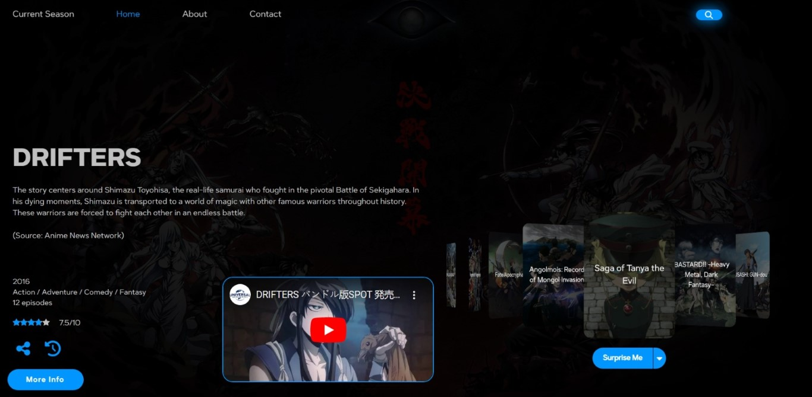
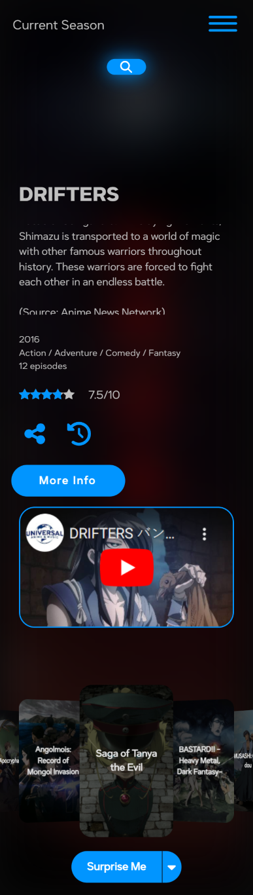

# Overview

This is a complete rewrite of the **Anime Info Platform** built exclusively with Vue 3. It builds on top of the ideas of the previous version with a more modern approach. All the featrues you know and love are still there, but with a new look and feel.

# Anime Info Platform v.2.0.0🔥

Check it out here [Anime Info Platform](https://anime-info-platform.vercel.app/).

Remember you can always reach out to me using the contact form

# Built With 💕

- Vue 3 💚
- Vite 💜
- AniList API 🧡

# Previews

More features will be added as time goes on. to get early access visit [the releases page](https://github.com/Mini-Sylar/Anime-Info-Platform/releases)

## Upcoming features
- Bookmark 🎉
- Current Season 🎉

# Contribution

Coming soon...

# Screenshots

